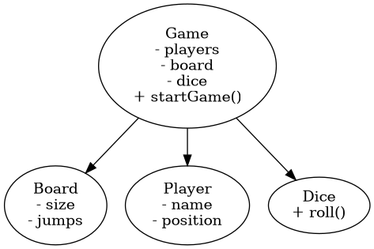
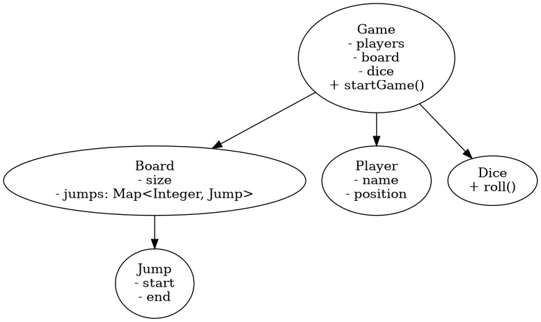
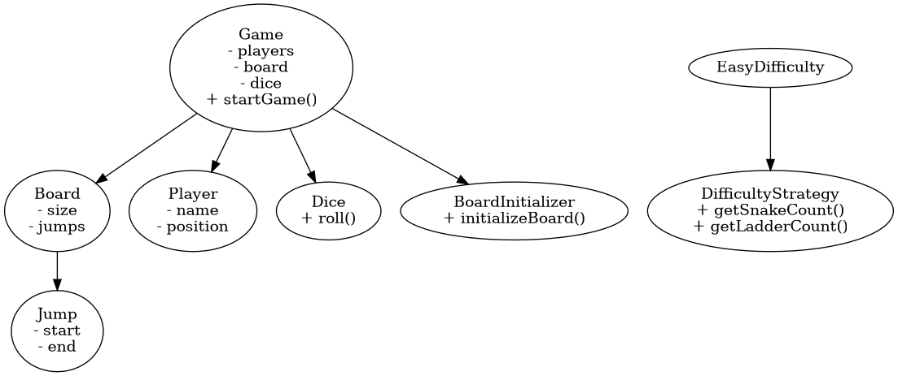

# 🐍 Snake and Ladder – Low Level Design Implementation .

### Designing a scalable system through iterative refactoring (V0 → V2)

## 🚀 Why This Project Stands Out

This project demonstrates a **step-by-step evolution of system design** from a naive implementation to a scalable and maintainable architecture.

Instead of directly jumping to the best solution, this project focuses on:

* Understanding **design problems**
* Applying **incremental refactoring**
* Using **SOLID principles**
* Implementing **design patterns**

---

# 📌 Problem Statement

Design a Snake and Ladder game with:

* Multiple players (≥ 2)
* Board of size **N x N**
* Random snakes and ladders
* Minimum vertical distance for jumps
* Multiple players allowed on same cell
* Game runs until a player wins

---

# 🧠 Design Evolution

---

## 🔹 V0 - Basic Design

### 📌 Description

A simple implementation where everything is handled inside the `Game` class.

### ❌ Problems

* Violates **Single Responsibility Principle (SRP)**
* Tight coupling between components
* Hard to extend or modify

---

### 📊 UML Diagram

---

## 🔹 V1 - Improved Structure

### 📌 Improvements

* Introduced `Jump` class for snakes and ladders
* Cleaner separation between Board and Game

### ❌ Remaining Issues

* Game still handles board initialization
* No validation logic
* Partial SRP violation

---

### 📊 UML Diagram

---

## 🔹 V2 - SOLID Design

### 📌 Key Improvements

#### ✅ BoardInitializer

* Handles creation of snakes and ladders
* Responsible for board setup

#### ✅ DifficultyStrategy (Strategy Pattern)

* Supports multiple difficulty levels
* Controls number of snakes and ladders

---

### ✅ Benefits

* Follows **Single Responsibility Principle**
* Follows **Open-Closed Principle**
* Better modularity and scalability
* Easier to extend and maintain

---

### 📊 UML Diagram

---

# 🧩 Design Patterns Used

### ✅ Strategy Pattern

* `DifficultyStrategy`
* Enables dynamic behavior without modifying existing code

---

# 🧠 Key Learnings

* Importance of **separation of concerns**
* How to **refactor systems incrementally**
* Applying **SOLID principles in real-world problems**
* Designing systems for **future extensibility**

---

# 🎯 Interview Q&A

### ❓ Why did you refactor V0?

In V0, the Game class had multiple responsibilities like handling turns, dice rolling, and jump logic. This violated SRP and made the system hard to extend.

---

### ❓ What improved in V2?

In V2, responsibilities were separated properly, and Strategy Pattern was introduced for difficulty, making the system extensible and clean.

---

### ❓ Which SOLID principles are applied?

* SRP → BoardInitializer separates setup logic
* OCP → DifficultyStrategy allows extension
* DIP → Game depends on abstractions

---

### ❓ Why Strategy Pattern?

It allows changing behavior (difficulty) without modifying existing code.

---

### ❓ How would you extend this system?

* Add GameRuleStrategy (custom rules)
* Add DiceStrategy (different dice behavior)
* Add Observer for UI/logging

---

# 👩‍💻 How to Run

1. Navigate to any version (V0 / V1 / V2)
2. Run `Main.java`

---

# ⭐ Conclusion

This project showcases how a simple system can evolve into a **scalable, maintainable design** using proper engineering principles.

---

⭐ If you found this helpful, feel free to star the repo!

This project reflects my approach to building **clean and extensible backend systems**.
